# Pyrocene guide

**restore the forest. hold the line.**

Pyrocene is a cooperative terminal game about holding back an invasive-species
invasion with good data and timely action. You play a two-person field team —
an ecologist who *sees* and a ranger who *acts* — sharing **one action per
night** on a landscape where lantana spreads on its own, matures, and, if
neglected, feeds a rare and devastating wildfire. You cannot fight the fire;
you fight the weed that feeds it, and you can only fight what you took the
time to see.

Win by bringing native forest above the line and **holding** it for three
nights. Every screen below is a real capture of the game's UI, regenerated
with `python3 intro/make_screens.py` (run the game itself with
`python3 -m terminal.play`).

---

## 1 · The menu

Two doors: learn, or play.

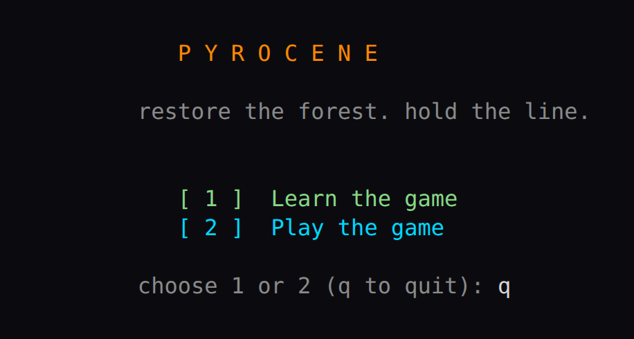

## 2 · Learn — why this game exists

"Learn the game" opens with five short pages of real fire ecology — the
satellites that see fires five metres wide, the 8,000 haze hotspots of Riau,
the drone crews of Gadchiroli — before a single tile is shown.

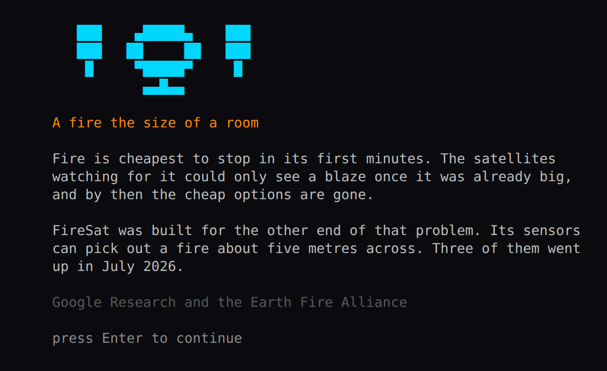

The last page states your job: look, remove, restore, hold.

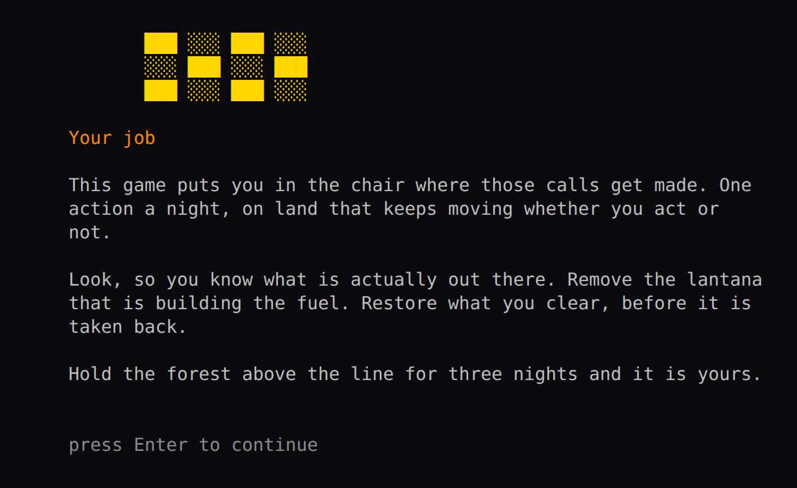

## 3 · Learn — reading the screen

The walkthrough introduces the UI one piece at a time: first the score —
native forest cover, and the line you must hold for three nights.

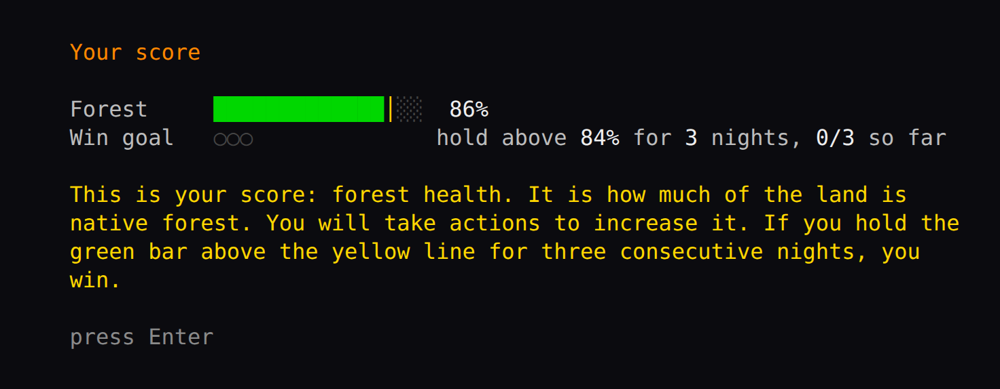

Then the team, who speak up here as things happen.

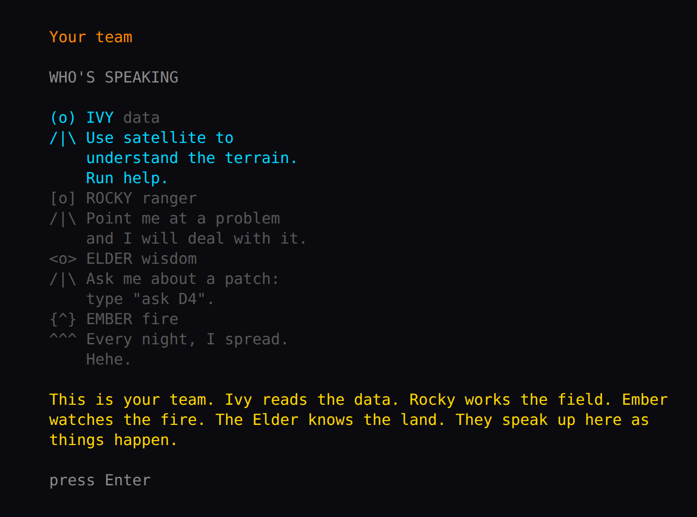

Then the land itself, on a fully revealed practice map.

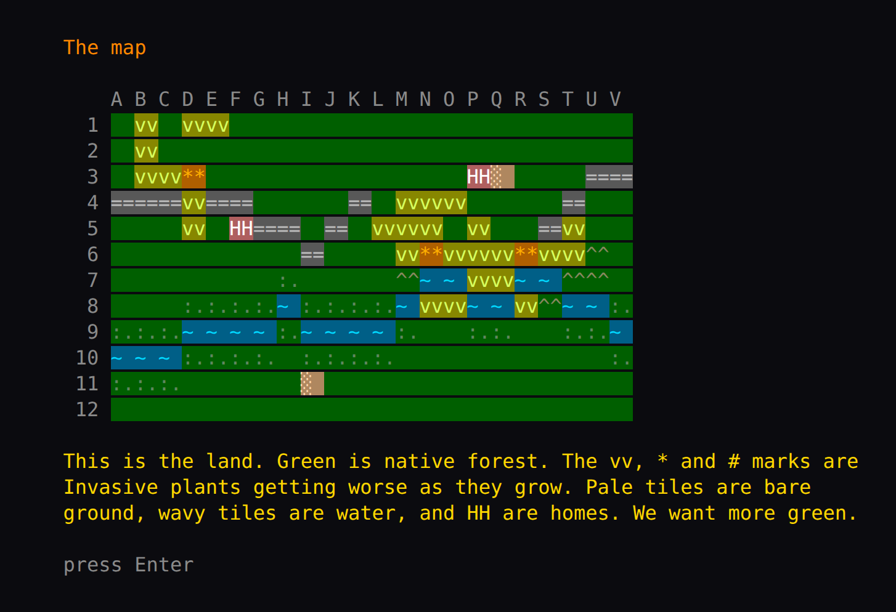

And the legend that names every tile.

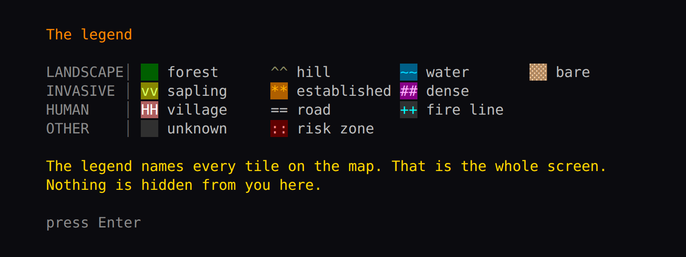

## 4 · Learn — your first task

The glowing patch is bare ground. Plant it, and watch the score rise.

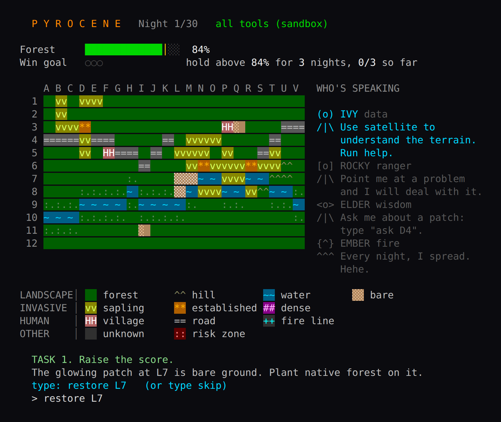

## 5 · Learn — what happens if you do nothing

The second task matures the lantana and lets nature run, until invasive fuel
does what invasive fuel does.

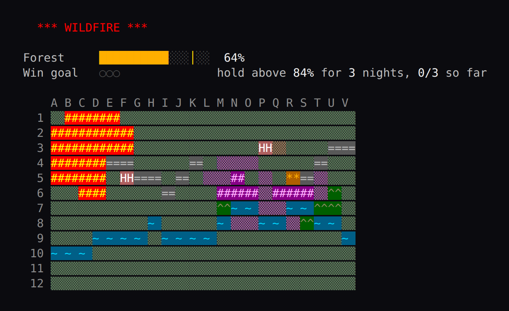

## 6 · The story — briefing before a level

Between levels the team briefs and debriefs you. Losing is part of the
curriculum: each loss earns the next tool.

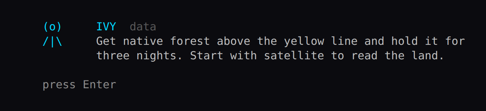

## 7 · Field — night one, satellite only

The real game starts in fog of war. The satellite reads the land roughly —
terrain, water, homes — but young lantana slips right past it.

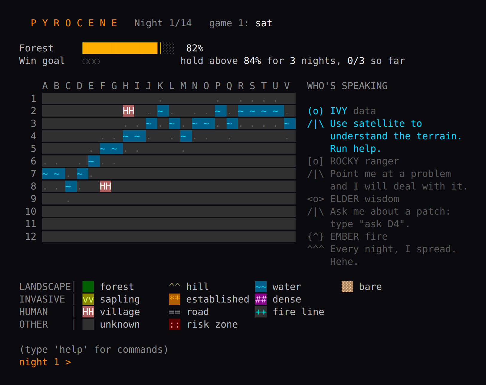

## 8 · Field — the drone confirms

A drone pass snaps haze to solid truth: hidden seedlings and established
stands pop into view where the satellite saw "clean" forest.

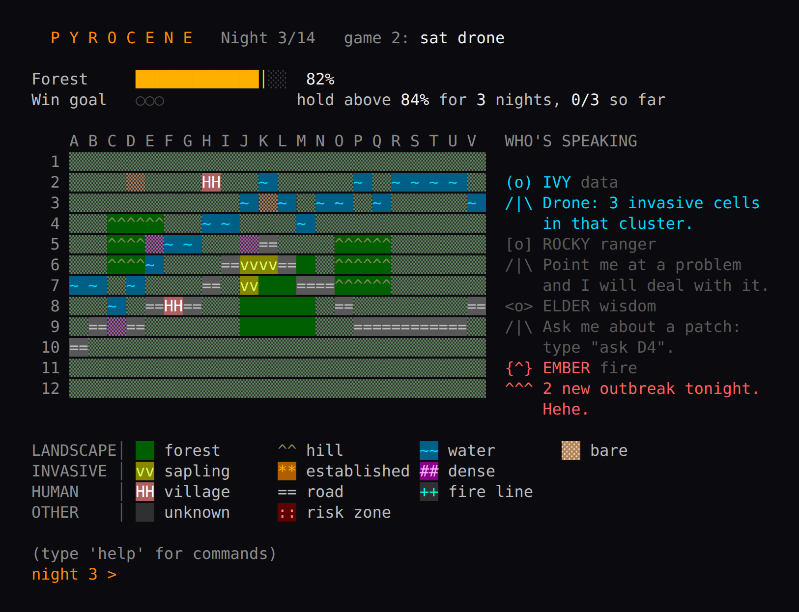

## 9 · Field — the advisor comes online

By level 4, Ivy has fused the drone, the elders, the fire watch and the field
notes into a decision-support system that names the one hotspot to cut each
night.

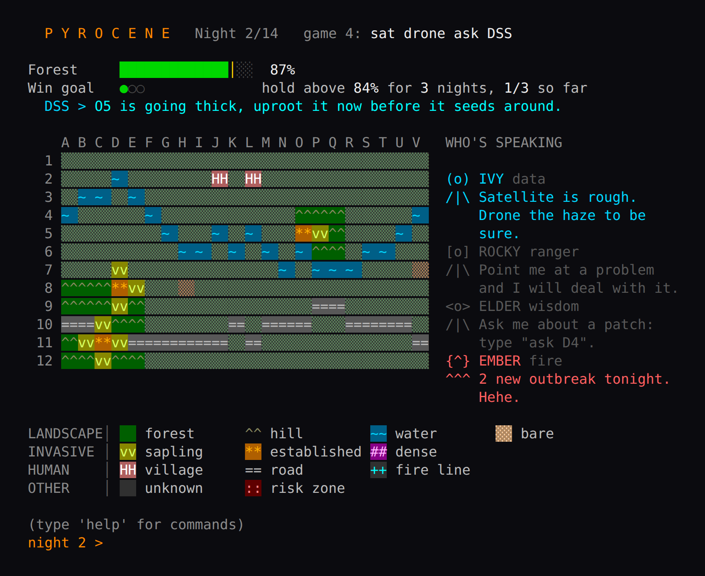

## 10 · Field — when the valley fights back

At the hardest tier, telegraphed disasters land with a field note from real
lantana ecology. Drought dries the land and feeds the fire; monsoon washes
seed down the banks.

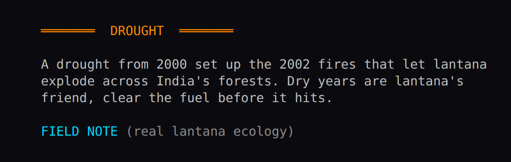

## 11 · Endings

Hold the line and the landscape comes back — and stays back.

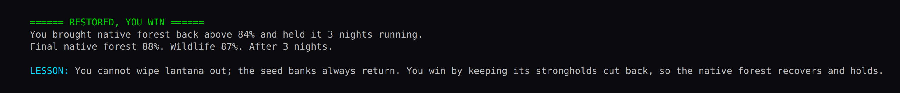

Neglect it, and the ecosystem unravels.

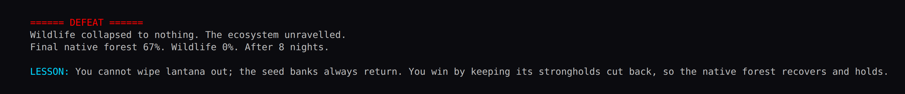

(A third, gold ending — 92% cover with living wildlife, held — exists for
true ecologists. It is earned, not shown.)

## 12 · The whole toolkit

`help` in the field lists every command, colour-coded by who runs it.

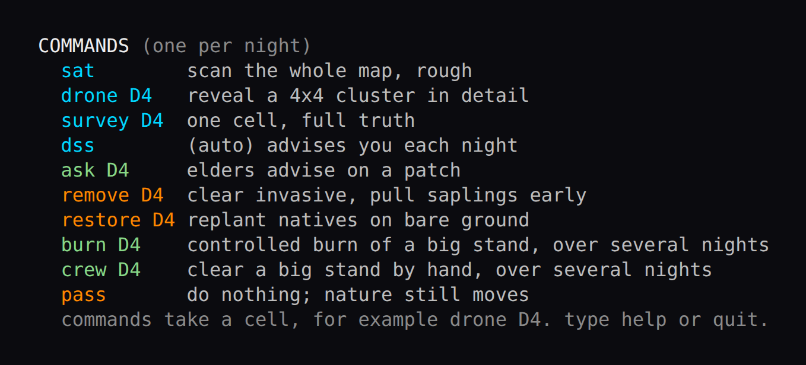

---

## Regenerating these screenshots

The images are captures of the actual UI, produced by driving the real game
code with a scripted keyboard and rasterising its ANSI output with headless
Chrome (no image libraries needed):

```bash
python3 intro/make_screens.py
```
